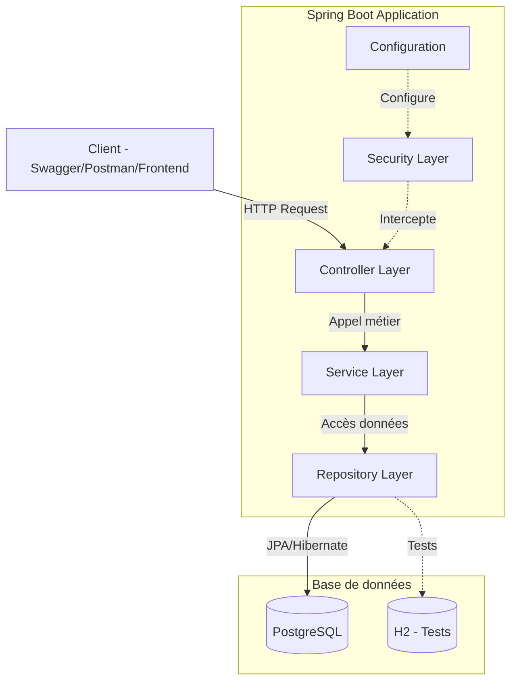
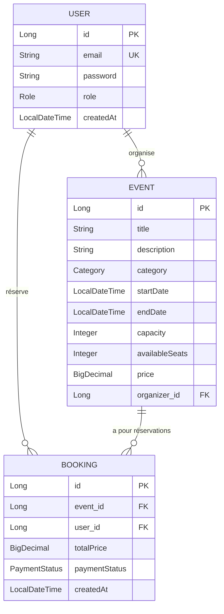
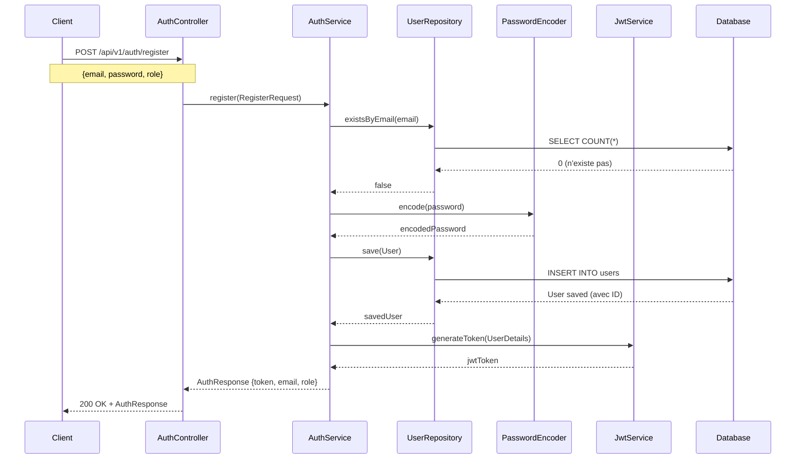
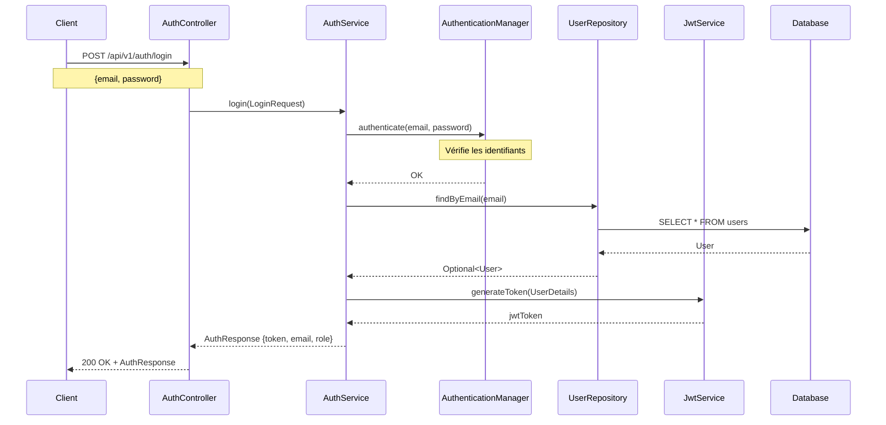
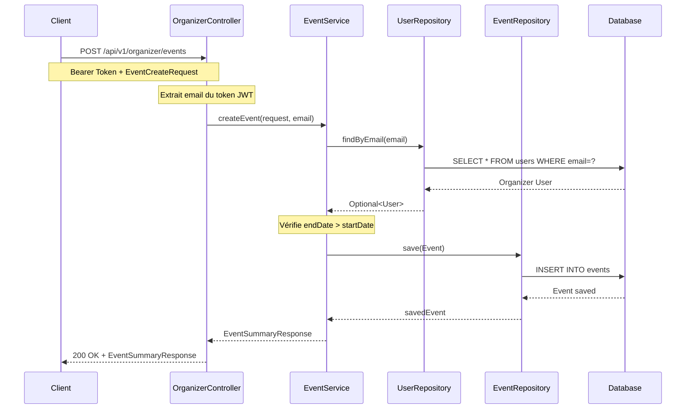
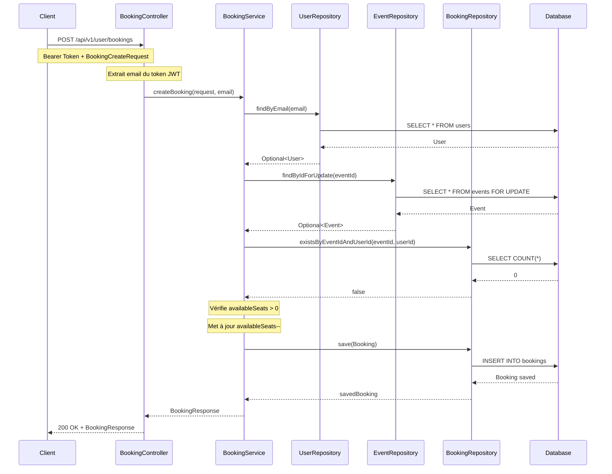

# Architecture du Projet Event Booking Backend

## Table des matières
1. [Structure du projet](#structure-du-projet)
2. [Architecture globale](#architecture-globale)
3. [Diagramme de classes](#diagramme-de-classes)
4. [Diagramme entité-relation (ERD)](#diagramme-entité-relation-erd)
5. [Diagrammes de séquence](#diagrammes-de-séquence)
6. [Diagramme des composants](#diagramme-des-composants)
7. [Endpoints API](#endpoints-api)

---

## Structure du projet

```
event-booking-backend/
├── src/
│   ├── main/
│   │   ├── java/com/eventhub/event_booking_backend/
│   │   │   ├── EventBookingBackendApplication.java
│   │   │   ├── config/
│   │   │   │   ├── OpenApiConfig.java
│   │   │   │   ├── SecurityConfig.java
│   │   │   ├── controller/
│   │   │   │   ├── AuthController.java
│   │   │   │   ├── BookingController.java
│   │   │   │   ├── EventController.java
│   │   │   │   ├── OrganizerController.java
│   │   │   ├── dto/
│   │   │   │   ├── request/
│   │   │   │   │   ├── BookingCreateRequest.java
│   │   │   │   │   ├── EventCreateRequest.java
│   │   │   │   │   ├── LoginRequest.java
│   │   │   │   │   ├── RegisterRequest.java
│   │   │   │   ├── response/
│   │   │   │   │   ├── AuthResponse.java
│   │   │   │   │   ├── BookingResponse.java
│   │   │   │   │   ├── EventSummaryResponse.java
│   │   │   ├── exception/
│   │   │   │   ├── BusinessException.java
│   │   │   │   ├── GlobalExceptionHandler.java
│   │   │   ├── model/
│   │   │   │   ├── Booking.java
│   │   │   │   ├── Category.java (enum)
│   │   │   │   ├── CustomField.java
│   │   │   │   ├── Event.java
│   │   │   │   ├── PaymentStatus.java (enum)
│   │   │   │   ├── Role.java (enum)
│   │   │   │   ├── User.java
│   │   │   ├── repository/
│   │   │   │   ├── BookingRepository.java
│   │   │   │   ├── EventRepository.java
│   │   │   │   ├── UserRepository.java
│   │   │   ├── security/
│   │   │   │   ├── JwtAuthenticationFilter.java
│   │   │   │   ├── JwtService.java
│   │   │   │   ├── UserDetailsServiceImpl.java
│   │   │   ├── service/
│   │   │       ├── AuthService.java
│   │   │       ├── BookingService.java
│   │   │       ├── EventService.java
│   │   │       ├── PaymentService.java
│   │   ├── resources/
│   │       ├── application.yml
│   ├── test/
│   │   ├── java/com/eventhub/event_booking_backend/
│   │   │   ├── EventBookingBackendApplicationTests.java
│   │   │   ├── config/
│   │   │   │   ├── TestConfig.java
│   │   │   ├── controller/
│   │   │   │   ├── AuthControllerIntegrationTest.java
│   │   │   │   ├── BookingControllerIntegrationTest.java
│   │   │   │   ├── EventControllerIntegrationTest.java
│   │   │   │   ├── OrganizerControllerIntegrationTest.java
│   │   │   ├── service/
│   │   │       ├── AuthServiceTest.java
│   │   │       ├── BookingServiceTest.java
│   │   │       ├── EventServiceTest.java
│   │   ├── resources/
│   │       ├── application.yml
├── pom.xml
```

---

## Architecture globale



---

## Diagramme de classes

```mermaid
classDiagram
    %% Entités JPA
    class User {
        -Long id
        -String email
        -String password
        -Role role
        -LocalDateTime createdAt
        +onCreate()
    }
    
    class Event {
        -Long id
        -String title
        -String description
        -Category category
        -LocalDateTime startDate
        -LocalDateTime endDate
        -Integer capacity
        -Integer availableSeats
        -BigDecimal price
        -User organizer
    }
    
    class Booking {
        -Long id
        -Event event
        -User user
        -BigDecimal totalPrice
        -PaymentStatus paymentStatus
        -LocalDateTime createdAt
        +onCreate()
    }
    
    %% Enums
    class Role {
        <<enumeration>>
        ROLE_USER
        ROLE_ORGANIZER
        ROLE_ADMIN
    }
    
    class Category {
        <<enumeration>>
        MUSIC
        BUSINESS
        TECH
        SPORT
        EDUCATION
        OTHER
    }
    
    class PaymentStatus {
        <<enumeration>>
        PENDING
        PAID
        COMPLETED
        CANCELLED
    }
    
    %% DTOs Request
    class RegisterRequest {
        -String email
        -String password
        -Role role
    }
    
    class LoginRequest {
        -String email
        -String password
    }
    
    class EventCreateRequest {
        -String title
        -String description
        -Category category
        -LocalDateTime startDate
        -LocalDateTime endDate
        -Integer capacity
        -BigDecimal price
    }
    
    class BookingCreateRequest {
        -Long eventId
    }
    
    %% DTOs Response
    class AuthResponse {
        -String token
        -String email
        -String role
    }
    
    class EventSummaryResponse {
        -Long id
        -String title
        -String description
        -Category category
        -LocalDateTime startDate
        -LocalDateTime endDate
        -Integer capacity
        -Integer availableSeats
        -BigDecimal price
        -Long organizerId
    }
    
    class BookingResponse {
        -Long bookingId
        -Long eventId
        -String eventTitle
        -BigDecimal totalPrice
        -String paymentStatus
    }
    
    %% Controllers
    class AuthController {
        +register(RegisterRequest)
        +login(LoginRequest)
    }
    
    class EventController {
        +getAll(Category)
        +getById(Long)
    }
    
    class BookingController {
        +createBooking(BookingCreateRequest, Authentication)
        +getMyBookings(Authentication)
    }
    
    class OrganizerController {
        +createEvent(EventCreateRequest, Authentication)
    }
    
    %% Services
    class AuthService {
        +register(RegisterRequest) AuthResponse
        +login(LoginRequest) AuthResponse
    }
    
    class EventService {
        +createEvent(EventCreateRequest, String) EventSummaryResponse
        +getAllEvents(Category) List~EventSummaryResponse~
        +getById(Long) EventSummaryResponse
    }
    
    class BookingService {
        +createBooking(BookingCreateRequest, String) BookingResponse
        +getMyBookings(String) List~BookingResponse~
    }
    
    %% Repositories
    class UserRepository {
        +existsByEmail(String) boolean
        +findByEmail(String) Optional~User~
    }
    
    class EventRepository {
        +findAll() List~Event~
        +findByCategory(Category) List~Event~
        +findByIdForUpdate(Long) Optional~Event~
    }
    
    class BookingRepository {
        +existsByEventIdAndUserId(Long, Long) boolean
        +findByUser(User) List~Booking~
    }
    
    %% Security
    class JwtService {
        +extractUsername(String) String
        +generateToken(UserDetails) String
        +isTokenValid(String, UserDetails) boolean
    }
    
    class JwtAuthenticationFilter {
        +doFilterInternal(HttpServletRequest, HttpServletResponse, FilterChain)
    }
    
    class UserDetailsServiceImpl {
        +loadUserByUsername(String) UserDetails
    }
    
    %% Relations entre entités
    User "1" --> "*" Event : organizer
    Event "1" --> "*" Booking : event
    User "1" --> "*" Booking : user
    
    %% Relations Controllers -> Services
    AuthController --> AuthService
    EventController --> EventService
    BookingController --> BookingService
    OrganizerController --> EventService
    
    %% Relations Services -> Repositories
    AuthService --> UserRepository
    EventService --> EventRepository
    EventService --> UserRepository
    BookingService --> BookingRepository
    BookingService --> EventRepository
    BookingService --> UserRepository
    
    %% Relations DTOs
    AuthController --> RegisterRequest
    AuthController --> LoginRequest
    AuthController --> AuthResponse
    OrganizerController --> EventCreateRequest
    OrganizerController --> EventSummaryResponse
    BookingController --> BookingCreateRequest
    BookingController --> BookingResponse
    EventController --> EventSummaryResponse
```



---

## Diagramme entité-relation (ERD)



---

## Diagrammes de séquence

### 1. Inscription d'un utilisateur (Register)



### 2. Connexion d'un utilisateur (Login)



### 3. Création d'un événement (Organizer)



### 4. Création d'une réservation (User)



---

## Diagramme des composants

```mermaid
graph LR
    subgraph Client["Client"]
        S[Swagger UI]
        P[Postman/curl]
        F[Frontend]
    end
    
    subgraph API["API Layer - Controllers"]
        A[AuthController]
        E[EventController]
        B[BookingController]
        O[OrganizerController]
    end
    
    subgraph Business["Business Layer - Services"]
        AS[AuthService]
        ES[EventService]
        BS[BookingService]
        PS[PaymentService]
    end
    
    subgraph Data["Data Layer - Repositories"]
        UR[UserRepository]
        ER[EventRepository]
        BR[BookingRepository]
    end
    
    subgraph Security["Security Layer"]
        JWT[JwtAuthenticationFilter]
        JS[JwtService]
        UDS[UserDetailsServiceImpl]
    end
    
    subgraph Database["Database"]
        DB[(PostgreSQL/H2)]
    end
    
    Client -->|HTTP| API
    API --> Business
    Business --> Data
    Data --> DB
    Security -.->|Intercepte| API
```



---

## Endpoints API

### Authentification (`/api/v1/auth`)
| Méthode | Endpoint | Description | Accès |
|---------|-----------|-------------|-------|
| POST | `/register` | Inscription | Public |
| POST | `/login` | Connexion | Public |

### Événements publics (`/api/v1/public/events`)
| Méthode | Endpoint | Description | Accès |
|---------|-----------|-------------|-------|
| GET | `/` | Lister tous les événements | Public |
| GET | `/{id}` | Détails d'un événement | Public |

### Utilisateur (`/api/v1/user`)
| Méthode | Endpoint | Description | Accès |
|---------|-----------|-------------|-------|
| POST | `/bookings` | Créer une réservation | Authentifié |
| GET | `/my-bookings` | Mes réservations | Authentifié |

### Organisateur (`/api/v1/organizer`)
| Méthode | Endpoint | Description | Accès |
|---------|-----------|-------------|-------|
| POST | `/events` | Créer un événement | ORGANIZER/ADMIN |

### Modèles de données

#### Requête d'inscription (RegisterRequest)
```json
{
  "email": "string",
  "password": "string",
  "role": "ROLE_USER | ROLE_ORGANIZER | ROLE_ADMIN"
}
```

#### Requête de connexion (LoginRequest)
```json
{
  "email": "string",
  "password": "string"
}
```

#### Réponse d'authentification (AuthResponse)
```json
{
  "token": "jwt-token",
  "email": "string",
  "role": "string"
}
```

#### Création d'événement (EventCreateRequest)
```json
{
  "title": "string",
  "description": "string",
  "category": "MUSIC | BUSINESS | TECH | SPORT | EDUCATION | OTHER",
  "startDate": "2026-04-29T10:00:00",
  "endDate": "2026-04-29T18:00:00",
  "capacity": 100,
  "price": 50.00
}
```

#### Réponse événement (EventSummaryResponse)
```json
{
  "id": 1,
  "title": "string",
  "description": "string",
  "category": "MUSIC",
  "startDate": "2026-04-29T10:00:00",
  "endDate": "2026-04-29T18:00:00",
  "capacity": 100,
  "availableSeats": 100,
  "price": 50.00,
  "organizerId": 1
}
```

---

## Technologies utilisées

- **Java 21**
- **Spring Boot 3.5.13**
- **Spring Security** (JWT Authentication)
- **Spring Data JPA** (Hibernate)
- **PostgreSQL** (Production)
- **H2** (Tests)
- **Maven** (Build tool)
- **Lombok** (Boilerplate reduction)
- **Swagger/OpenAPI 3** (Documentation API)
- **JJWT** (JSON Web Tokens)
- **BCrypt** (Password encoding)

---

## Tests

### Tests unitaires (Service Layer)
- `AuthServiceTest` - 3 tests
- `EventServiceTest` - 6 tests
- `BookingServiceTest` - 6 tests

### Tests d'intégration (Controller Layer)
- `AuthControllerIntegrationTest` - 4 tests
- `EventControllerIntegrationTest` - 4 tests
- `OrganizerControllerIntegrationTest` - 4 tests
- `BookingControllerIntegrationTest` - 5 tests

**Total : 26 tests unitaires + 17 tests d'intégration = 43 tests**

Commande pour lancer tous les tests :
```bash
mvn test
```
